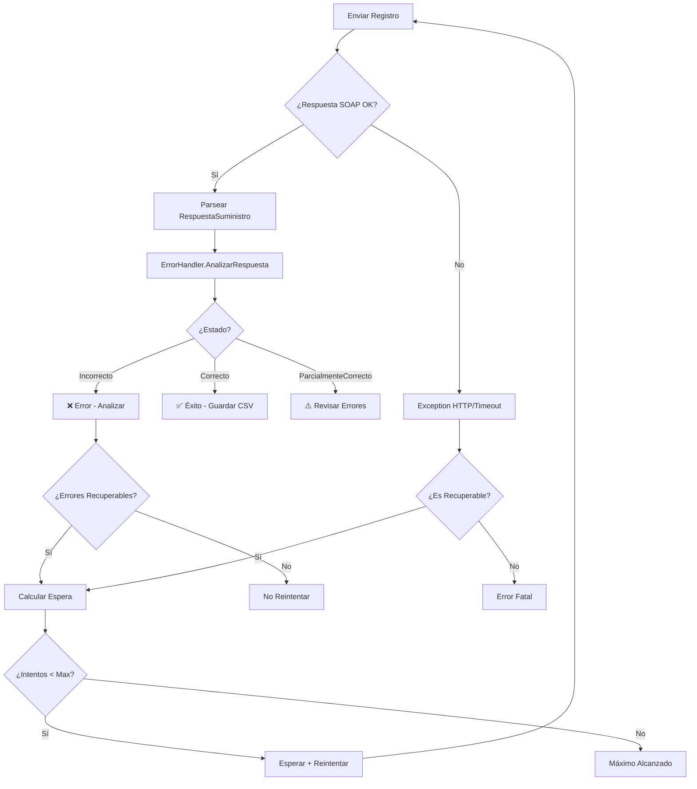

# Gestión de Respuestas AEAT y Manejo de Errores

## 📋 Descripción

Sistema completo de gestión de respuestas AEAT para VERI*FACTU que incluye:
- Parser de respuestas XML según `RespuestaSuministro.xsd`
- Catálogo de códigos de error AEAT con clasificación
- Gestión inteligente de errores (recuperables, validación, configuración)
- Lógica de reintentos con backoff exponencial
- Logging estructurado de errores

## 🏗️ Componentes

### 1. ErrorCatalog

Catálogo estático de códigos de error AEAT con información detallada:

```csharp
// Obtener información de un error
var info = ErrorCatalog.ObtenerInfoError("4001");
Console.WriteLine($"Tipo: {info.Tipo}");
Console.WriteLine($"Es admisible: {info.EsAdmisible}");
Console.WriteLine($"Acción: {info.AccionRecomendada}");

// Verificar si un error es recuperable
bool recuperable = ErrorCatalog.EsErrorRecuperable("9001"); // true (error temporal)

// Listar errores por tipo
var temporales = ErrorCatalog.ObtenerErroresPorTipo(ErrorCatalog.TipoError.Temporal);
```

#### Tipos de Error

- **Sintactico** (2xxx): Errores de validación XML, formato, tipos de datos
- **Negocio** (4xxx-8xxx): Errores de validación de reglas de negocio
- **Configuracion** (1xxx): Errores de autenticación y certificados
- **Temporal** (9xxx): Errores temporales del servicio AEAT
- **Desconocido**: Errores no catalogados

#### Categorías de Recuperabilidad

- **Recuperable**: Error recuperable mediante reintento automático (timeout, servicio no disponible)
- **RequiereCorreccion**: Error que requiere corrección de datos antes de reenviar
- **RequiereSubsanacion**: Error que requiere subsanación (envío con indicador)
- **NoRecuperable**: Error irrecuperable que requiere intervención manual

### 2. ErrorHandler

Servicio para análisis y gestión de respuestas AEAT:

```csharp
var errorHandler = new ErrorHandler(logger); // logger opcional

// Analizar respuesta
var analisis = errorHandler.AnalizarRespuesta(respuestaAeat);

// Verificar resultado
if (analisis.EsExitoso)
{
    Console.WriteLine($"CSV: {analisis.CSV}");
}
else
{
    Console.WriteLine($"Correctos: {analisis.RegistrosCorrectos}");
    Console.WriteLine($"Rechazados: {analisis.RegistrosRechazados}");
    
    foreach (var error in analisis.ErroresNoAdmisibles)
    {
        Console.WriteLine($"Error {error.CodigoError}: {error.Descripcion}");
        Console.WriteLine($"Factura: {error.FacturaAfectada}");
        Console.WriteLine($"Acción: {error.AccionRecomendada}");
    }
}

// Determinar si se debe reintentar
if (errorHandler.DebeReintentarse(respuestaAeat))
{
    var espera = errorHandler.CalcularTiempoEspera(respuestaAeat, intento);
    await Task.Delay(espera);
    // reintentar...
}
```

#### Clase ResultadoAnalisisErrores

Contiene información completa del análisis:

```csharp
public class ResultadoAnalisisErrores
{
    public string EstadoEnvio { get; set; }             // "Correcto", "ParcialmenteCorrecto", "Incorrecto"
    public string? CSV { get; set; }                     // Código Seguro de Verificación
    public int? TiempoEsperaEnvio { get; set; }         // Segundos de espera indicados por AEAT
    
    public bool EsExitoso { get; set; }
    public bool TieneErroresParciales { get; set; }
    
    public int RegistrosProcesados { get; set; }
    public int RegistrosCorrectos { get; set; }
    public int RegistrosAceptadosConErrores { get; set; }
    public int RegistrosRechazados { get; set; }
    public int RegistrosDuplicados { get; set; }
    
    public List<DetalleError> ErroresNoAdmisibles { get; set; }
    public List<DetalleError> ErroresAdmisibles { get; set; }
    
    public Dictionary<TipoError, int> ErroresPorTipo { get; set; }
    
    public bool TieneErroresRecuperables { get; set; }
    public bool RequiereSubsanacion { get; set; }
    
    public List<string> InformacionAdicional { get; set; }
}
```

### 3. ReintentosService

Servicio para envío de registros con reintentos automáticos:

```csharp
var soapClient = new VerifactuSoapClient(endpointUrl, soapAction);
var errorHandler = new ErrorHandler();
var reintentosService = new ReintentosService(soapClient, errorHandler, logger);

// Enviar con reintentos
var resultado = await reintentosService.EnviarConReintentosAsync(
    xmlFirmado,
    certificado,
    OpcionesReintento.Produccion // o PorDefecto, Pruebas, o personalizado
);

if (resultado.Exitoso)
{
    Console.WriteLine($"Exitoso en intento {resultado.ExitosoEnIntento} de {resultado.NumeroIntentos}");
    Console.WriteLine($"CSV: {resultado.CSV}");
    Console.WriteLine($"Duración total: {resultado.DuracionTotal}");
    
    // Tiempos de espera utilizados
    foreach (var espera in resultado.TiemposEspera)
    {
        Console.WriteLine($"Espera: {espera.TotalSeconds}s");
    }
}
else
{
    Console.WriteLine($"Fallido después de {resultado.NumeroIntentos} intentos");
    Console.WriteLine($"Motivo: {resultado.MotivoFallo}");
    
    // Analizar errores
    if (resultado.AnalisisErrores != null)
    {
        foreach (var error in resultado.AnalisisErrores.ErroresNoAdmisibles)
        {
            Console.WriteLine($"- {error.CodigoError}: {error.Descripcion}");
            Console.WriteLine($"  Acción: {error.AccionRecomendada}");
        }
    }
}
```

#### Configuración de Reintentos

##### Opciones Predefinidas

```csharp
// Por defecto (desarrollo/testing)
var defecto = OpcionesReintento.PorDefecto;
// MaximoIntentos: 3
// TiempoBaseSegundos: 2
// TiempoMaximoEsperaSegundos: 300

// Producción (más conservador)
var produccion = OpcionesReintento.Produccion;
// MaximoIntentos: 5
// TiempoBaseSegundos: 5
// TiempoMaximoEsperaSegundos: 600

// Pruebas (más rápido)
var pruebas = OpcionesReintento.Pruebas;
// MaximoIntentos: 2
// TiempoBaseSegundos: 1
// TiempoMaximoEsperaSegundos: 60
```

##### Opciones Personalizadas

```csharp
var opcionesCustom = new OpcionesReintento
{
    MaximoIntentos = 4,
    TiempoBaseSegundos = 3,
    TiempoMaximoEsperaSegundos = 180
};
```

#### Backoff Exponencial

El servicio implementa backoff exponencial con jitter aleatorio:

- **Fórmula**: `TiempoEspera = TiempoBase * 2^intento * (1 + jitter)`
- **Jitter**: ±25% aleatorio para evitar "thundering herd"
- **Máximo**: Respeta `TiempoMaximoEsperaSegundos`
- **Prioridad AEAT**: Si AEAT especifica `TiempoEsperaEnvio`, se usa ese valor

**Ejemplo con TiempoBase = 2s:**
- Intento 1: ~2s
- Intento 2: ~4s (con jitter: 3-5s)
- Intento 3: ~8s (con jitter: 6-10s)
- Intento 4: ~16s (con jitter: 12-20s)
- Intento 5+: Limitado por TiempoMaximoEsperaSegundos

## 📊 Estados y Códigos de Error

### Estados de Envío (EstadoEnvio)

| Estado | Descripción |
|--------|-------------|
| `Correcto` | Todos los registros aceptados correctamente |
| `ParcialmenteCorrecto` | Algunos correctos, algunos rechazados o con errores admisibles |
| `Incorrecto` | Todos los registros rechazados o error estructural |

### Estados de Registro (EstadoRegistro)

| Estado | Descripción | ¿Se registra? |
|--------|-------------|---------------|
| `Correcto` | Registro totalmente correcto | ✅ Sí |
| `AceptadoConErrores` | Errores admisibles, no provocan rechazo | ✅ Sí |
| `Incorrecto` | Errores no admisibles, provocan rechazo | ❌ No |

### Códigos de Error Principales

#### Autenticación y Certificados (1xxx)

- **1001**: Certificado no válido o caducado
- **1002**: NIF del certificado no coincide con NIF emisor

#### Validación Sintáctica (2xxx)

- **2001**: XML no conforme al esquema XSD
- **2002**: Campo obligatorio no presente
- **2003**: Formato de campo incorrecto

#### Validación de Negocio - NIF (4xxx)

- **4001**: NIF del emisor no identificado en base de datos AEAT
- **4002**: NIF no válido o formato incorrecto

#### Huella y Encadenado (5xxx)

- **5001**: Huella calculada incorrecta
- **5002**: Encadenamiento incorrecto - huella anterior no coincide

#### Duplicados (6xxx)

- **6001**: Registro duplicado - factura ya registrada

#### Importes y Datos Fiscales (7xxx)

- **7001**: Importe total no coincide con suma de líneas
- **7002**: Base imponible incorrecta
- **7003**: Tipo impositivo no válido

#### Errores Admisibles (8xxx)

- **8001**: Campo opcional con formato no recomendado
- **8002**: Información complementaria incompleta

#### Errores Temporales (9xxx)

- **9001**: Servicio temporalmente no disponible
- **9002**: Timeout procesando petición
- **9003**: Servidor en mantenimiento

> **Nota**: El catálogo incluye códigos representativos. El documento oficial de validaciones AEAT contiene >900 validaciones. Se recomienda extender `ErrorCatalog` con todos los códigos según necesidades específicas.

## 🔄 Flujo de Procesamiento



## 🧪 Testing

El sistema incluye 37 tests unitarios:

```bash
# Ejecutar todos los tests
dotnet test

# Ejecutar solo tests de error handling
dotnet test --filter "FullyQualifiedName~ErrorCatalogTests"
dotnet test --filter "FullyQualifiedName~ErrorHandlerTests"
dotnet test --filter "FullyQualifiedName~ReintentosServiceTests"
```

### Cobertura de Tests

- **ErrorCatalog**: 11 tests
  - Obtener información de errores
  - Clasificación por tipo y recuperabilidad
  - Manejo de códigos no catalogados
  
- **ErrorHandler**: 16 tests
  - Análisis de respuestas correctas/incorrectas/parciales
  - Detección de errores admisibles y no admisibles
  - Detección de duplicados
  - Cálculo de tiempos de espera
  
- **ReintentosService**: 10 tests
  - Éxito en primer intento
  - Errores recuperables con reintentos
  - Errores no recuperables sin reintentos
  - Máximo de intentos alcanzado
  - Respeto de tiempo de espera AEAT
  - Backoff exponencial

## 📚 Ejemplos de Uso

Ver `src/Verifactu.Client/Examples/ErrorHandlingExamples.cs` para ejemplos completos:

1. Consultar catálogo de errores
2. Análisis de respuesta AEAT
3. Respuesta parcialmente correcta
4. Configuración de reintentos
5. Manejo de duplicados

Ejecutar ejemplos:

```csharp
using Verifactu.Client.Examples;

await ErrorHandlingExamples.EjecutarTodosLosEjemplosAsync();
```

## 🔒 Logging Estructurado

El sistema implementa logging estructurado usando `ILogger<T>`:

```csharp
// Con logging
var logger = loggerFactory.CreateLogger<ErrorHandler>();
var errorHandler = new ErrorHandler(logger);

// Logs generados:
// - Information: Envíos exitosos, errores admisibles
// - Warning: Errores recuperables, aceptación parcial
// - Error: Errores no recuperables, máximo de reintentos
```

Ejemplo de log:

```
[Information] Envío AEAT exitoso. CSV: ABC123, Registros correctos: 5/5
[Warning] Envío AEAT parcialmente correcto. Correctos: 3, Rechazados: 1, Admisibles con error: 1
[Warning] Error no admisible 4001: NIF no identificado. Factura: FAC-001 (07-11-2024). Acción: Verificar NIF
[Error] Envío AEAT rechazado completamente. Total errores: 3
```

## ⚙️ Integración con Sistema Existente

### Actualización de Cliente SOAP

El `VerifactuSoapClient` ya incluye soporte para parsear respuestas:

```csharp
// El cliente retorna RespuestaSuministro parseada
var respuesta = await soapClient.EnviarRegFacturacionAltaAsync(xmlFirmado, cert);

// Analizar con ErrorHandler
var errorHandler = new ErrorHandler();
var analisis = errorHandler.AnalizarRespuesta(respuesta);
```

### Flujo Completo Recomendado

```csharp
// 1. Configurar servicios
var soapClient = new VerifactuSoapClient(endpointUrl, soapAction);
var errorHandler = new ErrorHandler(logger);
var reintentosService = new ReintentosService(soapClient, errorHandler, logger);

// 2. Preparar registro
var xmlDoc = serializer.CrearXmlRegistro(registro);
var xmlFirmado = signer.Firmar(xmlDoc, certificado);

// 3. Enviar con reintentos
var resultado = await reintentosService.EnviarConReintentosAsync(
    xmlFirmado,
    certificado,
    OpcionesReintento.Produccion
);

// 4. Procesar resultado
if (resultado.Exitoso)
{
    // Guardar CSV y actualizar estado
    await GuardarRegistroExitoso(registro, resultado.CSV);
}
else
{
    // Analizar errores y tomar acción
    var analisis = resultado.AnalisisErrores;
    
    if (analisis.RequiereSubsanacion)
    {
        // Programar subsanación
        await ProgramarSubsanacion(registro, analisis);
    }
    else if (!analisis.TieneErroresRecuperables)
    {
        // Error no recuperable - notificar
        await NotificarErrorCritico(registro, analisis);
    }
}
```

## 📖 Referencias

- **Documentación oficial AEAT**: `docs/Veri-Factu_Descripcion_SWeb.md`
  - Sección "Validaciones y errores"
  - Sección "Códigos de respuesta"
  - Sección "Tipos de errores definidos"

- **Guía técnica interna**: `docs/Verifactu-Guia-Tecnica.md`
  - Sección 4.4: Documento de validaciones y errores

- **Esquemas XSD**: `docs/wsdl/`
  - `RespuestaSuministro.xsd`: Esquema de respuesta oficial
  - `SuministroInformacion.xsd`: Tipos comunes

## 🚀 Próximas Mejoras

- [ ] Completar catálogo con los >900 códigos de error oficiales
- [ ] Métricas y telemetría (Prometheus, Application Insights)
- [ ] Persistencia de historial de reintentos
- [ ] Circuit breaker para protección de servicio
- [ ] Notificaciones automáticas (email, webhook) para errores críticos
- [ ] Dashboard de monitoreo de errores
- [ ] Exportación de estadísticas de errores

## 🤝 Contribuir

Para añadir nuevos códigos de error al catálogo:

1. Consultar documento oficial de validaciones AEAT
2. Añadir entrada en `ErrorCatalog._errores` con toda la información
3. Clasificar correctamente: `TipoError`, `Categoria`, `EsAdmisible`
4. Proporcionar `AccionRecomendada` clara y accionable
5. Añadir tests en `ErrorCatalogTests.cs`

## 📄 Licencia

Este código forma parte del proyecto Veri-factuSender.
